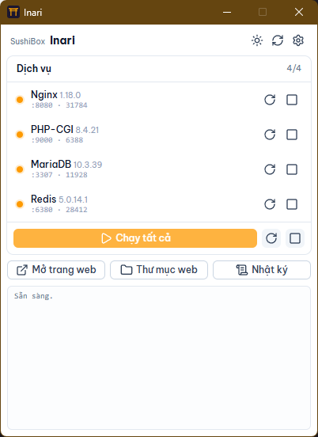
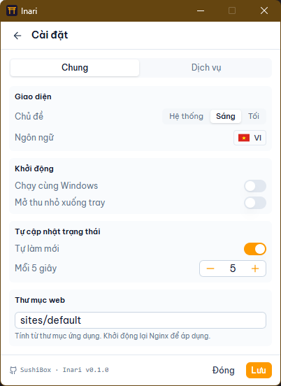
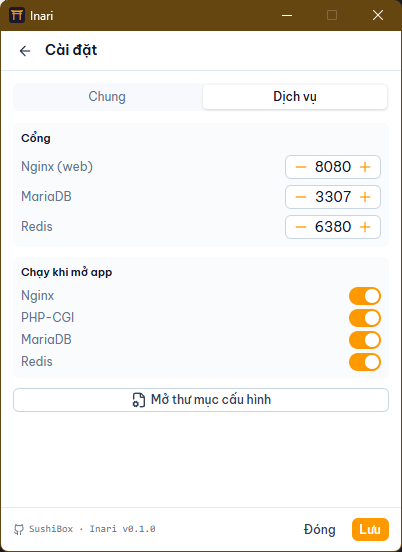
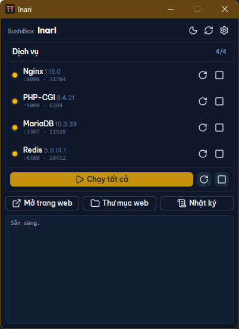
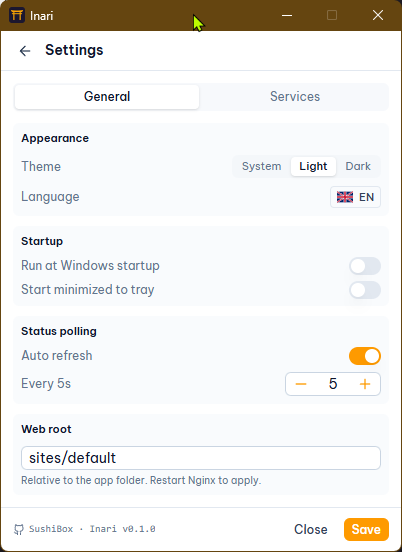

<p align="center">
  
</p>

<h1 align="center">Inari</h1>

<p align="center">
  English | <a href="README.vi.md">Tiếng Việt</a>
</p>

A portable, copy-and-run Windows dev runtime manager. Bundles nginx, PHP,
MariaDB, and Redis behind a small native control panel, so you can run a full
PHP stack without installing anything.

Inari is part of the **SushiBox** toolset.

> Think Laragon or XAMPP, but portable by default: unzip the folder, double-click,
> and your stack is running. Nothing touches the registry or `Program Files`.

> **Beta.** Inari is early software. It runs the muh5 dev stack well and is
> tested on Windows 11. Expect rough edges and please report issues via Issues.

<p align="center">
  
</p>

## Install note (first run)

Inari is not code-signed yet, so Windows SmartScreen may warn on first launch.
Click **More info → Run anyway**. The app is unsigned open source; you can read
or build the source here.

It also needs the Microsoft Edge **WebView2** runtime to draw its window. This
ships with Windows 11 and is preinstalled on most up-to-date Windows 10. If the
window does not appear, install the WebView2 runtime from Microsoft (free), then
relaunch.

## Features

- **One window, all services.** Start, stop, and restart nginx, PHP-CGI,
  MariaDB, and Redis from a single compact panel.
- **Truly portable.** Everything lives in one folder. Copy it to a USB stick or
  another machine and it just runs. No installer, no admin rights.
- **GUI-first configuration.** Ports, web root, auto-start, dark mode, and
  language are all set from the panel. No hand-editing config files.
- **Auto-start on launch.** Choose which services come up when you open Inari.
- **Bundled Adminer shortcut.** Open a local database UI from the panel when the
  web stack is running.
- **System tray.** Closing the window hides to tray; the stack keeps running.
- **English and Vietnamese** interface, switchable in Settings.

## Quick start

1. Download the portable bundle and unzip it anywhere.
2. Double-click `Inari.exe`. The control panel opens (no console window).
3. Click **Start all**, or start services individually.
4. Your site is served from `sites/default` at <http://localhost:8080>.

Use the **Open site** button in the panel to launch it in your browser. When
nginx/PHP are running, **Adminer** opens the bundled database UI at
`/_inari/adminer.php` without copying files into your web root.

> **SmartScreen note.** Inari is not code-signed yet, so Windows SmartScreen may
> show "Windows protected your PC" on first launch. Click **More info → Run
> anyway**. The bundle is open source; you can build it yourself (see below).

### Default ports

| Service | Port |
|---|---|
| Control panel | 1788 |
| nginx (web) | 8080 |
| MariaDB | 3307 |
| Redis | 6380 |

PHP-CGI listens on 9000 internally. All services bind to `127.0.0.1` only.

## Your code

Put your PHP project in `sites/default` (or point the **Web root** in Settings
at another folder). nginx routes `*.php` to PHP-CGI; static files are served
directly. A starter `index.php` and a `health.php` JSON endpoint ship in the
default site so you can confirm the stack works.

### Laravel

For Laravel apps, point **Web root** to the app's `public/` folder, not the
project root:

```text
D:\code\my-laravel-app\public
```

Inari's generated nginx config supports Laravel-style front-controller routing:
static files are served directly, and unknown routes fall through to
`/index.php?$query_string`.

## Command line

For automation or scripting, `inari-cli.exe` exposes the same controls with
console output:

```
inari-cli.exe start      # start all available services
inari-cli.exe stop       # stop running services
inari-cli.exe restart    # restart all
inari-cli.exe status     # show service status and ports
```

`Inari.exe` is the GUI (no console); `inari-cli.exe` is the headless CLI.

## Configuration

Most things are set in the panel. For defaults, edit `flavors/default.lua`
(ports, sites, hooks). The panel writes overrides to `data/settings.json`, which
wins over the flavor file. nginx.conf and php.ini are generated automatically on
each start, tuned for local development.

## Requirements

- Windows 10/11, or Windows Server 2019 or newer (64-bit).
- On Windows 11 and Server 2025 the system WebView2 (Edge) runtime is used. On
  Server 2019/2022, include the fixed-version WebView2 runtime in the bundle
  (see `runtime/manifest.toml`).

## Building from source

Inari is a Rust workspace plus a Nuxt panel.

```
# Build the panel (embedded into the binary)
cd panel && bun run build

# Build the GUI and CLI
cargo build --release

# Assemble a portable bundle into dist/
powershell -ExecutionPolicy Bypass -File scripts/package-portable.ps1
```

Runtime binaries (nginx, PHP, MariaDB, Redis, Adminer) are not committed. Fetch
them with `scripts/fetch-runtime.ps1` before packaging.

## Screenshots

Settings — General and Services (ports, auto-start, web root):

<p align="center">
  
  &nbsp;
  
</p>

Docks to the bottom-right corner, above the taskbar, like PowerToys / PC Manager:

<p align="center">
  
</p>

Dark theme and English interface:

<p align="center">
  
  &nbsp;
  
</p>

## License

Inari's own code is MIT licensed (see [LICENSE](LICENSE)).

Inari bundles third-party runtime software, each under its own license. See
[THIRD_PARTY.md](THIRD_PARTY.md) for the full list and source links. Notably,
the bundled MariaDB server is GPL-2.0; if you redistribute an Inari bundle, the
GPL source-availability terms apply.

## Links

- Homepage: [greenjade.net](https://greenjade.net/)
